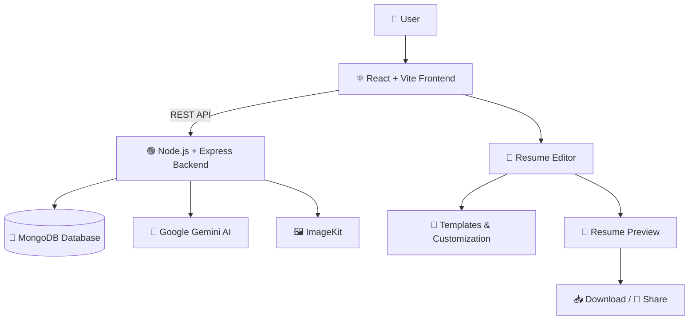
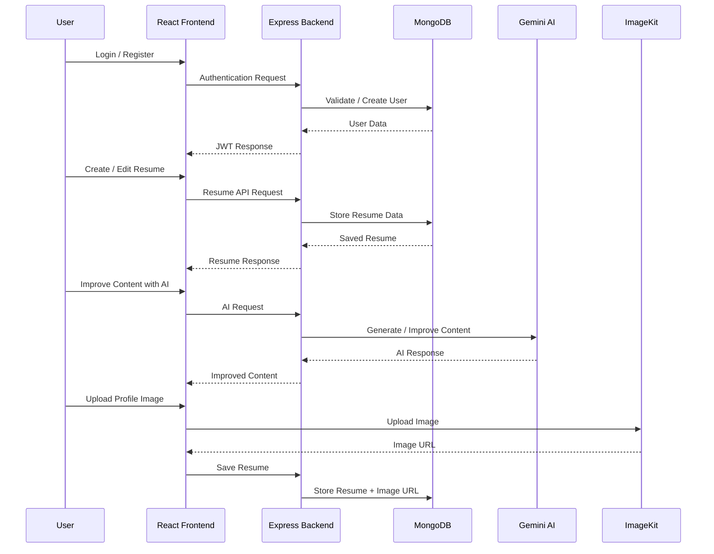

# 🚀 AI-Powered Resume Builder

<p align="center">
  
  
  
  
  
  
</p>

<p align="center">
  <strong>A full-stack AI-powered platform for creating, editing, customizing, downloading, and sharing professional resumes.</strong>
</p>

<p align="center">
  <a href="https://resume-builder-ashen-omega.vercel.app/">
    🌐 <strong>Live Demo</strong>
  </a>
  &nbsp;&nbsp;•&nbsp;&nbsp;
  <a href="https://github.com/MounikaChelamsetti/resume-builder">
    💻 <strong>Source Code</strong>
  </a>
</p>

---

## 📌 Overview

Creating a professional resume from scratch can be time-consuming. Users often struggle with structuring their experience, writing effective professional summaries, choosing suitable templates, and maintaining a consistent professional design.

**AI-Powered Resume Builder** solves this problem by providing an interactive full-stack platform where users can create and manage professional resumes with the help of AI.

The application allows users to:

- 👤 Create an account and securely log in
- 📝 Create resumes from scratch
- ✏️ Edit resume information dynamically
- 🤖 Improve resume content using Google Gemini AI
- 🎨 Choose from multiple resume templates
- 🌈 Customize resume accent colors
- 🖼️ Upload and manage profile images
- 📄 Parse uploaded resume/PDF content
- 👀 Preview resumes before downloading
- 📥 Download completed resumes
- 🔗 Share resumes publicly when required
- 🔒 Keep resumes associated with authenticated users
- ☁️ Access the application through a cloud deployment

---

## ✨ Key Features

### 🔐 Authentication

Users can create an account and securely access their resumes.

The authentication system provides:

- User registration
- User login
- JWT-based authentication
- Protected API routes
- User-specific resume access
- Password hashing using `bcrypt`

Each authenticated user can access and manage their own resume data.

---

### 📝 Resume Creation

Users can create a professional resume by entering information such as:

- Personal information
- Professional summary
- Education
- Work experience
- Projects
- Skills
- Other relevant resume information

Resume data is stored in MongoDB and associated with the authenticated user.

---

### 🤖 AI-Powered Resume Assistance

The backend integrates **Google Gemini AI** to provide AI-assisted resume content generation and improvement.

Users can provide basic content and use AI assistance to make it:

- More professional
- Concise
- Clear
- Job-oriented
- ATS-friendly

This reduces the effort required to write strong resume content.

---

### 🎨 Multiple Resume Templates

The application provides multiple resume layouts so users can select a design that matches their professional requirements.

Available template styles include:

| Template | Description |
|---|---|
| 📄 Classic | Traditional professional resume layout |
| ✨ Modern | Modern layout with visual accents |
| 🖊️ Minimal | Clean and content-focused design |
| 🖼️ Minimal Image | Minimal layout with profile image |

Users can switch between templates while editing their resume.

---

### 🌈 Custom Accent Colors

Users can customize the visual appearance of their resume using an accent color selector.

This allows the same resume content to be presented with different visual styles without changing the actual information.

---

### 🖼️ Profile Image Management

The application supports profile image upload and management.

**ImageKit** is used for image storage and delivery, allowing uploaded profile images to be handled separately from the main application server.

---

### 📄 Resume / PDF Parsing

The application supports processing uploaded resume content.

This makes it possible to extract useful information from an existing resume and reduce the amount of manual data entry required.

---

### 👀 Resume Preview

Users can preview their resume while editing it.

The preview helps users verify:

- Content
- Layout
- Template
- Accent colors
- Profile image
- Overall appearance

before downloading or sharing the final resume.

---

### 📥 Download & 🔗 Sharing

Once a resume is completed, users can:

- Download the resume
- Share the resume
- Generate a public resume view when sharing is enabled

This makes the application useful both for creating a resume and distributing it to recruiters or employers.

---

## 🏗️ System Architecture

This project follows a **full-stack client-server architecture**.

The React frontend communicates with the Node.js + Express backend through REST APIs.

The backend is responsible for authentication, resume management, database operations, AI processing, and image-related operations.



### 🔄 Application Flow



---

## 🧩 Technology Stack

### Frontend

- ⚛️ React.js
- ⚡ Vite
- 🎨 CSS / UI components
- 🌐 REST API integration
- 📱 Responsive design

### Backend

- 🟢 Node.js
- 🚂 Express.js
- 🔐 JWT Authentication
- 🔒 bcrypt password hashing
- 🌐 REST APIs

### Database

- 🍃 MongoDB
- 📦 MongoDB data models for users and resumes

### AI

- 🤖 Google Gemini API

Used for AI-assisted resume content enhancement.

### Image Management

- 🖼️ ImageKit

Used for profile image storage and delivery.

### Deployment

- ▲ Vercel — Frontend
- 🚀 Render — Backend
- 🍃 MongoDB — Cloud database

---

## 📂 Project Structure

```text
resume-builder/
│
├── client/
│   ├── src/
│   │   ├── components/
│   │   ├── pages/
│   │   ├── templates/
│   │   ├── assets/
│   │   └── ...
│   │
│   ├── public/
│   ├── package.json
│   └── ...
│
├── server/
│   ├── controllers/
│   ├── models/
│   ├── routes/
│   ├── middleware/
│   ├── config/
│   ├── server.js
│   └── package.json
│
├── .gitignore
└── README.md
```

> The exact files and folders may evolve as new features are added.

---

## 🚀 How to Use the Application

### 1️⃣ Open the application

Visit the live application:

**https://resume-builder-ashen-omega.vercel.app/**

### 2️⃣ Create an account

Register a new account and log in.

### 3️⃣ Create your resume

Enter your:

- Personal information
- Professional summary
- Education
- Experience
- Projects
- Skills

### 4️⃣ Enhance content with AI

Use the AI assistance to improve sections of your resume and make the content more professional.

### 5️⃣ Choose a template

Select the resume design that best matches your requirements.

### 6️⃣ Customize the appearance

Choose an accent color and configure the resume appearance.

### 7️⃣ Preview

Review the complete resume before finalizing it.

### 8️⃣ Download or share

Download the finished resume or share it publicly when required.

---

## 💻 Local Development Setup

Follow these steps to run the project locally.

### Prerequisites

Make sure the following are installed:

- Node.js
- npm
- Git
- MongoDB account/database
- Google Gemini API access
- ImageKit account

---

### 1. Clone the repository

```bash
git clone https://github.com/MounikaChelamsetti/resume-builder.git
```

```bash
cd resume-builder
```

---

### 2. Install frontend dependencies

```bash
cd client
npm install
```

---

### 3. Install backend dependencies

Open another terminal and run:

```bash
cd server
npm install
```

---

### 4. Configure environment variables

Create the required `.env` file inside the backend according to the environment variables used by the project.

Typical configuration includes values for:

```text
MONGODB_URI
JWT_SECRET
GEMINI_API_KEY
IMAGEKIT configuration
```

> Never commit API keys, database credentials, JWT secrets, or other sensitive environment variables to GitHub.

---

### 5. Start the backend

From the `server` directory:

```bash
npm start
```

or use the development command configured in the project.

---

### 6. Start the frontend

From the `client` directory:

```bash
npm run dev
```

The Vite development server will provide a local URL, usually similar to:

```text
http://localhost:5173
```

---

## 🔌 API Architecture

The frontend communicates with the backend through REST APIs.

The general request flow is:

```text
React Frontend
      │
      │ HTTP Request
      ▼
Express Routes
      │
      ▼
Controllers
      │
      ├──────────────► MongoDB
      │
      ├──────────────► Google Gemini
      │
      └──────────────► ImageKit
      │
      ▼
JSON Response
      │
      ▼
React Frontend
```

This separation keeps the frontend responsible for the user interface while the backend handles business logic and external services.

---

## 🧠 Important Engineering Concepts Used

### 🔐 JWT Authentication

JWT tokens are used to maintain authenticated sessions.

The token allows the backend to identify the logged-in user and protect user-specific resume operations.

---

### 🔒 Password Security

Passwords are never stored directly in plain text.

They are hashed using `bcrypt` before being stored in the database.

---

### 🗄️ User-Specific Data

Resume data is associated with the authenticated user.

This prevents users from directly accessing resumes belonging to another account through normal application requests.

---

### 🌐 REST API Communication

The frontend and backend are separated into independent layers.

The frontend sends HTTP requests to the backend and receives structured responses.

This makes the application easier to maintain and extend.

---

## 🧪 Challenges & Solutions

Building this application involved solving several practical full-stack development challenges.

### Challenge 1 — Connecting Frontend and Backend

**Problem:**

The React frontend and Express backend run as separate applications, especially after deployment.

**Solution:**

REST APIs were used as the communication layer between the frontend and backend.

This allows the frontend to request authentication, resume data, AI processing, and other backend functionality through HTTP requests.

---

### Challenge 2 — Securing User Resume Data

**Problem:**

Each user should only be able to access their own resumes.

**Solution:**

JWT-based authentication was implemented.

Authenticated requests are verified on the backend before user-specific resume operations are performed.

---

### Challenge 3 — Password Security

**Problem:**

Storing plain-text passwords would create a serious security risk.

**Solution:**

Passwords are hashed using `bcrypt` before being stored in MongoDB.

---

### Challenge 4 — Integrating AI into Resume Creation

**Problem:**

Users may provide incomplete or poorly structured resume content.

**Solution:**

Google Gemini was integrated into the backend to improve and generate professional resume content.

This allows users to transform basic information into clearer and more professional content.

---

### Challenge 5 — Managing Resume Templates

**Problem:**

The same resume information needs to work with different visual layouts.

**Solution:**

Resume content is separated from template presentation.

This allows users to switch templates without having to recreate their resume data.

---

### Challenge 6 — Profile Image Management

**Problem:**

Storing and serving image files directly through the backend can increase server-side complexity.

**Solution:**

ImageKit is used for profile image storage and delivery.

The application can store the resulting image reference along with the resume data.

---

### Challenge 7 — Cloud Deployment

**Problem:**

The frontend and backend need to be deployed independently while still communicating correctly.

**Solution:**

The frontend is deployed using Vercel and the backend using Render.

Environment variables and API configuration are used to connect the deployed services.

---

## 📈 Future Improvements

The project can be extended with additional features such as:

- 📊 ATS resume scoring
- 🎯 Job-description-based resume optimization
- 💼 Job-specific resume generation
- 📄 More professional resume templates
- 📤 Export to additional document formats
- 🔗 Custom public resume URLs
- 📈 Resume analytics
- 🌙 Dark mode
- 👥 Collaborative resume editing
- 🧠 More advanced AI recommendations

---

## 🌐 Deployment

### Frontend

The React + Vite frontend is deployed on **Vercel**.

### Backend

The Node.js + Express backend is deployed on **Render**.

### Database

MongoDB is used for persistent application data.

### External Services

The application integrates:

- Google Gemini for AI functionality
- ImageKit for image management

---

## 🔗 Project Links

### 🌐 Live Application

https://resume-builder-ashen-omega.vercel.app/

### 💻 GitHub Repository

https://github.com/MounikaChelamsetti/resume-builder

### 👩‍💻 Developer

**Mounika Chelamsetti**

B.Tech — Computer Science Engineering (Artificial Intelligence)

GitHub:

https://github.com/MounikaChelamsetti

---

## ⭐ Why This Project?

This project demonstrates practical experience in building and deploying a **full-stack web application** rather than only creating a frontend interface.

It combines:

- ⚛️ Modern frontend development
- 🟢 Backend API development
- 🔐 Authentication
- 🗄️ Database management
- 🤖 Generative AI integration
- 🖼️ Cloud image management
- 📄 Resume processing
- ☁️ Cloud deployment
- 🔗 Public sharing

The project demonstrates how multiple technologies can work together to solve a real-world problem.

---

## 🎯 Skills Demonstrated

```text
Frontend Development
        ↓
React + Vite
        ↓
REST API Integration
        ↓
Node.js + Express
        ↓
Authentication & Security
        ↓
MongoDB
        ↓
Google Gemini AI
        ↓
ImageKit
        ↓
Cloud Deployment
```

---

## 👩‍💻 Author

### Mounika Chelamsetti

B.Tech — Computer Science Engineering (Artificial Intelligence)

Built as a full-stack project demonstrating modern web development, AI integration, authentication, database management, and cloud deployment.

<p align="center">
  🚀 <strong>Build your resume. Improve your profile. Land your opportunity.</strong>
</p>

<p align="center">
  <a href="https://resume-builder-ashen-omega.vercel.app/">
    🌐 <strong>Visit Live Demo</strong>
  </a>
</p>

---

## ⭐ Support

If you found this project useful or interesting, consider giving the repository a ⭐ on GitHub.

<p align="center">
  <strong>Made with ❤️ by Mounika Chelamsetti</strong>
</p>
